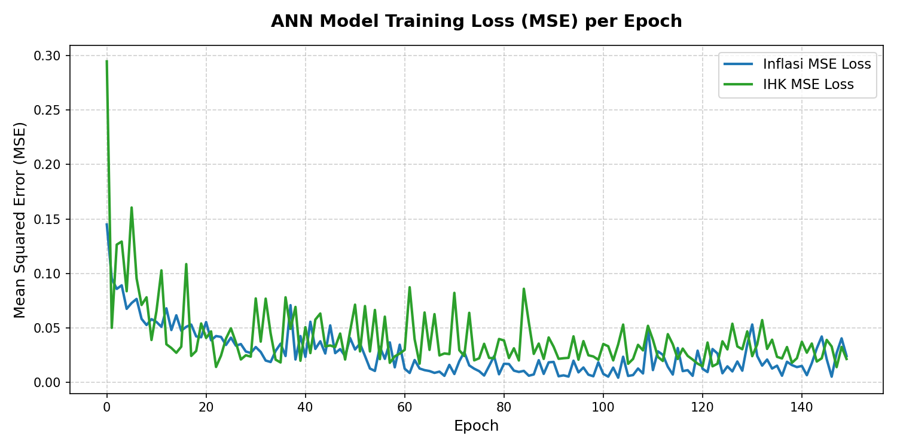
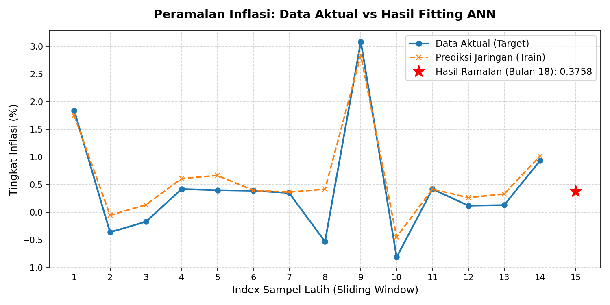
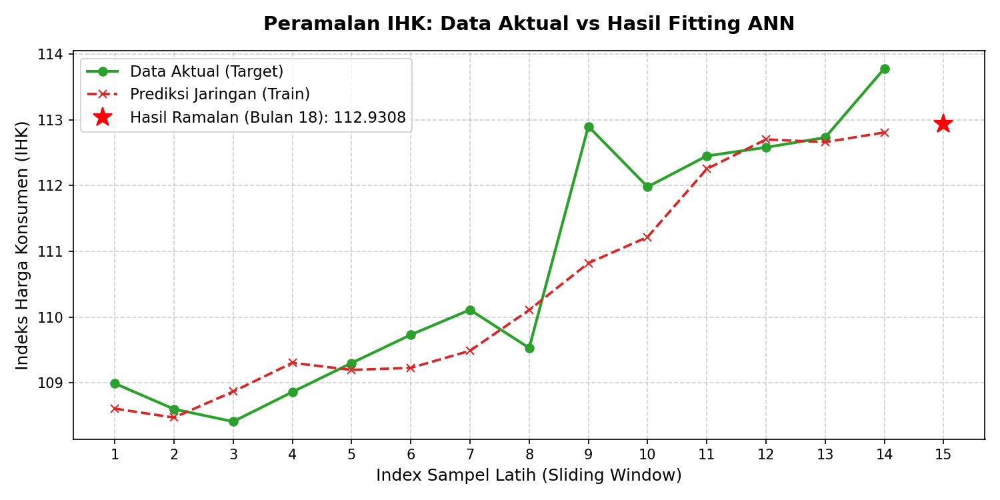

# Hasil Pelatihan dan Peramalan Artificial Neural Network (ANN)

Berikut adalah ringkasan hasil pengujian model Jaringan Saraf Tiruan (ANN) yang dilatih menggunakan data historis 17 bulan untuk **KOTA BANDA ACEH**.

---

## 1. Nilai Peramalan (Bulan ke-18 - Juni 2026)

| Variabel | Nilai Ramalan | Nilai Terakhir (Mei 2026) | Trend / Keterangan |
| :--- | :---: | :---: | :--- |
| **Inflasi** | `0.3758%` | `0.9300%` | Turun |
| **IHK** | `112.9308` | `113.7800` | Turun |

---

## 2. Grafik Hasil Pelatihan (Loss Function)

Grafik di bawah menunjukkan kurva penurunan tingkat error (**Mean Squared Error / MSE**) model Inflasi dan IHK selama 150 epoch pelatihan. Loss yang mengecil mendekati nol menandakan model berhasil belajar secara optimal.

---

## 3. Perbandingan Data Aktual vs Prediksi Model

Grafik di bawah ini membandingkan data aktual historis dengan hasil fitting (prediksi) model ANN saat fase latihan, serta menampilkan proyeksi nilai hasil ramalan untuk bulan ke-18.

### A. Grafik Peramalan Inflasi

### B. Grafik Peramalan IHK

---

## 4. Hasil Peramalan Kelompok Komoditas Utama

Berikut adalah estimasi nilai inflasi untuk 11 kelompok komoditas utama di **KOTA BANDA ACEH** pada bulan ke-18:

| Kelompok Komoditas | Nilai Ramalan (%) | Final Training Loss (MSE) |
| :--- | :---: | :---: |
| Makanan, Minuman dan Tembakau | `-0.2326%` | `0.007709` |
| Pakaian dan Alas Kaki | `0.8527%` | `0.040137` |
| Perumahan, Air, Listrik dan Bahan Bakar Rumah Tangga | `0.1455%` | `0.012244` |
| Perlengkapan, Peralatan dan Pemeliharaan Rutin Rumah Tangga | `-0.5175%` | `0.030568` |
| Kesehatan | `0.6770%` | `0.028008` |
| Informasi, Komunikasi dan Jasa Keuangan | `3.0118%` | `0.019638` |
| Transportasi | `0.2732%` | `0.016045` |
| Rekreasi, Olahraga dan Budaya | `0.1869%` | `0.068250` |
| Pendidikan | `-0.1990%` | `0.065756` |
| Penyediaan Makanan dan Minuman / Restoran | `0.5925%` | `0.045602` |
| Perawatan Pribadi dan Jasa Lainnya | `4.3244%` | `0.031992` |
