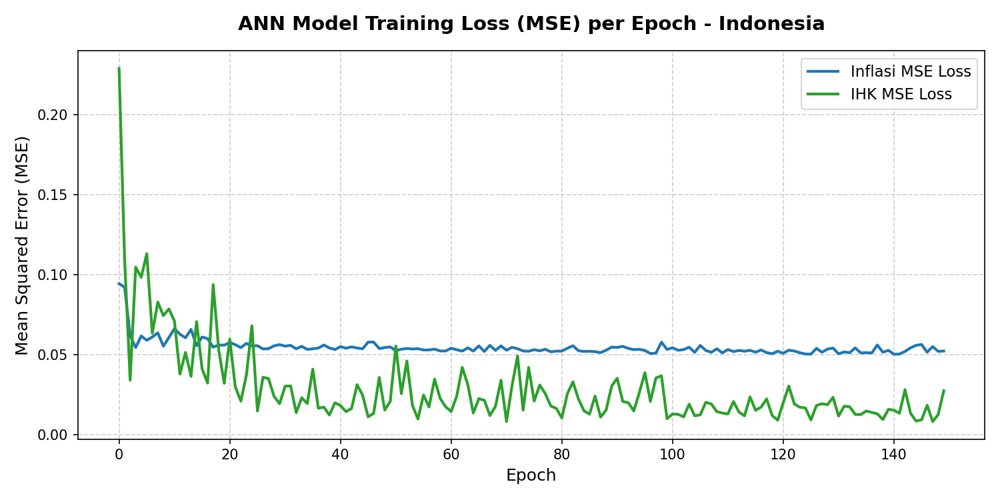
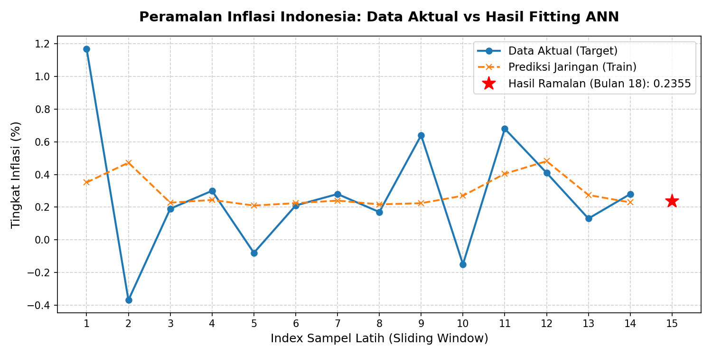
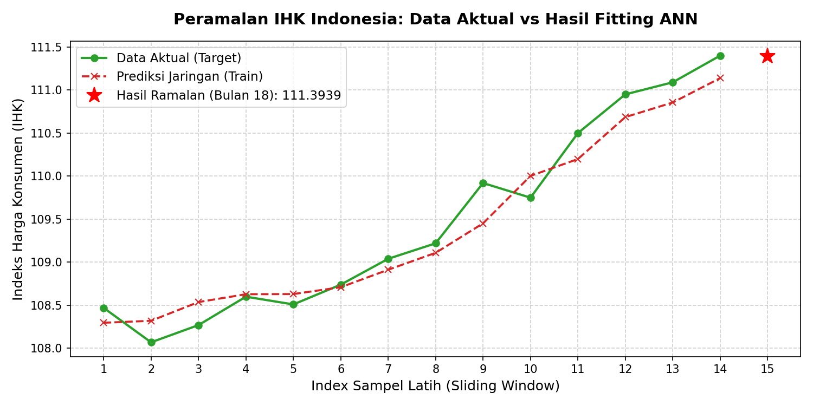

# Hasil Pelatihan dan Peramalan Artificial Neural Network (ANN) - Nasional
            
Berikut adalah ringkasan hasil pengujian model Jaringan Saraf Tiruan (ANN) yang dilatih menggunakan data historis 17 bulan untuk **INDONESIA**.

---

## 1. Nilai Peramalan (Bulan ke-18 - Juni 2026)

| Variabel | Nilai Ramalan | Nilai Terakhir (Mei 2026) | Trend / Keterangan |
| :--- | :---: | :---: | :--- |
| **Inflasi** | `0.2355%` | `0.2800%` | Turun |
| **IHK** | `111.3939` | `111.4000` | Turun |

---

## 2. Tabel Data Input Historis & Hasil Peramalan (Inflasi & IHK)

Tabel di bawah ini menampilkan 17 data masuk (input historis) yang digunakan untuk melatih model ANN, diikuti oleh hasil peramalan untuk Bulan ke-18 (Juni 2026) pada variabel utama:

| Bulan Ke- | Periode | Data Masuk: Inflasi | Data Masuk: IHK | Status Data |
| :---: | :---: | :---: | :---: | :--- |
| 1 | Jan 2025 | `-0.7600%` | `105.9900` | Historis (YoY) |
| 2 | Feb 2025 | `-0.4800%` | `105.4800` | Historis (YoY) |
| 3 | Mar 2025 | `1.6500%` | `107.2200` | Historis (YoY) |
| 4 | Apr 2025 | `1.1700%` | `108.4700` | Historis (YoY) |
| 5 | Mei 2025 | `-0.3700%` | `108.0700` | Historis (YoY) |
| 6 | Jun 2025 | `0.1900%` | `108.2700` | Historis (YoY) |
| 7 | Jul 2025 | `0.3000%` | `108.6000` | Historis (YoY) |
| 8 | Ags 2025 | `-0.0800%` | `108.5100` | Historis (YoY) |
| 9 | Sep 2025 | `0.2100%` | `108.7400` | Historis (YoY) |
| 10 | Okt 2025 | `0.2800%` | `109.0400` | Historis (YoY) |
| 11 | Nov 2025 | `0.1700%` | `109.2200` | Historis (YoY) |
| 12 | Des 2025 | `0.6400%` | `109.9200` | Historis (YoY) |
| 13 | Jan 2026 | `-0.1500%` | `109.7500` | Historis (Berjalan) |
| 14 | Feb 2026 | `0.6800%` | `110.5000` | Historis (Berjalan) |
| 15 | Mar 2026 | `0.4100%` | `110.9500` | Historis (Berjalan) |
| 16 | Apr 2026 | `0.1300%` | `111.0900` | Historis (Berjalan) |
| 17 | Mei 2026 | `0.2800%` | `111.4000` | Historis (Berjalan) |
| 18 | **Jun 2026** | **`0.2355%`** | **`111.3939`** | **Hasil Ramalan (ANN)** |

---

## 3. Tabel Data Input Historis & Hasil Peramalan Komoditas (Kelompok I)

Tabel di bawah ini menampilkan data masuk historis (17 bulan) dan hasil peramalan (Bulan 18) untuk Kelompok Komoditas Utama bagian I:

| Bulan Ke- | Periode | Makanan & Tembakau | Pakaian & Alas Kaki | Perumahan & Energi | Perlengkapan RT | Kesehatan |
| :---: | :---: | :---: | :---: | :---: | :---: | :---: |
| 1 | Jan 2025 | `1.9400%` | `0.1000%` | `-9.1600%` | `0.1300%` | `0.4000%` |
| 2 | Feb 2025 | `-0.4000%` | `0.0100%` | `-3.5900%` | `0.0000%` | `0.1700%` |
| 3 | Mar 2025 | `1.2400%` | `0.4500%` | `8.4500%` | `0.0100%` | `0.2200%` |
| 4 | Apr 2025 | `0.0700%` | `-0.0400%` | `6.6000%` | `0.0900%` | `0.1000%` |
| 5 | Mei 2025 | `-1.4000%` | `0.0300%` | `0.0200%` | `-0.0400%` | `0.0000%` |
| 6 | Jun 2025 | `0.4600%` | `0.0500%` | `0.0900%` | `-0.0100%` | `0.0900%` |
| 7 | Jul 2025 | `0.7400%` | `0.1000%` | `0.1100%` | `0.0700%` | `0.1700%` |
| 8 | Ags 2025 | `-0.2900%` | `-0.1000%` | `0.0300%` | `-0.0600%` | `0.0500%` |
| 9 | Sep 2025 | `0.3800%` | `0.0300%` | `0.0300%` | `-0.0100%` | `0.1300%` |
| 10 | Okt 2025 | `0.0800%` | `0.0000%` | `0.0300%` | `-0.0100%` | `0.2500%` |
| 11 | Nov 2025 | `0.0600%` | `0.0300%` | `0.0200%` | `0.0300%` | `0.1200%` |
| 12 | Des 2025 | `1.6600%` | `0.0000%` | `0.0600%` | `0.0000%` | `0.0900%` |
| 13 | Jan 2026 | `-1.0300%` | `0.0000%` | `0.0600%` | `0.1000%` | `0.2000%` |
| 14 | Feb 2026 | `1.5400%` | `0.1800%` | `0.0800%` | `0.0500%` | `0.1600%` |
| 15 | Mar 2026 | `1.0700%` | `0.3700%` | `0.0900%` | `0.0400%` | `0.1000%` |
| 16 | Apr 2026 | `-0.2000%` | `0.1000%` | `0.1400%` | `0.4400%` | `0.1000%` |
| 17 | Mei 2026 | `0.3900%` | `0.0800%` | `0.2800%` | `0.3400%` | `0.2100%` |
| 18 | **Jun 2026** | **`0.0050%`** | **`0.0611%`** | **`0.1858%`** | **`0.9634%`** | **`0.1493%`** |

---

## 4. Tabel Data Input Historis & Hasil Peramalan Komoditas (Kelompok II)

Tabel di bawah ini menampilkan data masuk historis (17 bulan) dan hasil peramalan (Bulan 18) untuk Kelompok Komoditas Utama bagian II:

| Bulan Ke- | Periode | Info & Keuangan | Transportasi | Rekreasi & Budaya | Pendidikan | Restoran | Perawatan & Jasa |
| :---: | :---: | :---: | :---: | :---: | :---: | :---: | :---: |
| 1 | Jan 2025 | `-0.0800%` | `0.1800%` | `0.2000%` | `0.1300%` | `0.3000%` | `0.6000%` |
| 2 | Feb 2025 | `0.0100%` | `0.3600%` | `0.1100%` | `0.0100%` | `0.1700%` | `1.2900%` |
| 3 | Mar 2025 | `0.0000%` | `-0.0800%` | `0.0400%` | `0.0000%` | `0.1200%` | `0.9500%` |
| 4 | Apr 2025 | `-0.4200%` | `-0.0100%` | `0.1400%` | `0.0100%` | `0.1900%` | `2.4600%` |
| 5 | Mei 2025 | `0.3100%` | `-0.0700%` | `0.0900%` | `0.0000%` | `0.0900%` | `0.2300%` |
| 6 | Jun 2025 | `-0.0100%` | `0.0700%` | `0.0900%` | `-0.0500%` | `0.0700%` | `0.3300%` |
| 7 | Jul 2025 | `-0.0400%` | `0.0000%` | `0.1000%` | `0.8200%` | `0.0700%` | `0.0700%` |
| 8 | Ags 2025 | `-0.0400%` | `-0.1900%` | `0.0900%` | `0.1300%` | `0.1000%` | `0.1800%` |
| 9 | Sep 2025 | `0.0100%` | `-0.0200%` | `0.0200%` | `0.0100%` | `0.0800%` | `1.2400%` |
| 10 | Okt 2025 | `0.0300%` | `0.1000%` | `0.1600%` | `0.1400%` | `0.0600%` | `3.0500%` |
| 11 | Nov 2025 | `-0.0200%` | `0.3400%` | `0.0200%` | `0.0000%` | `0.0600%` | `1.2100%` |
| 12 | Des 2025 | `-0.0300%` | `0.5500%` | `0.1000%` | `0.0100%` | `0.1300%` | `1.0000%` |
| 13 | Jan 2026 | `0.0100%` | `-0.4600%` | `0.0900%` | `0.0300%` | `0.1900%` | `2.2800%` |
| 14 | Feb 2026 | `0.1100%` | `-0.1100%` | `0.0200%` | `0.0100%` | `0.1800%` | `2.5500%` |
| 15 | Mar 2026 | `0.0600%` | `0.4100%` | `0.1600%` | `0.0300%` | `0.1700%` | `-0.2100%` |
| 16 | Apr 2026 | `0.4300%` | `0.9900%` | `0.2600%` | `0.0100%` | `0.6900%` | `-0.9900%` |
| 17 | Mei 2026 | `0.4500%` | `0.6100%` | `0.1900%` | `0.0100%` | `0.4000%` | `-0.7400%` |
| 18 | **Jun 2026** | **`0.7794%`** | **`-0.0508%`** | **`0.1155%`** | **`0.0721%`** | **`0.9691%`** | **`0.1956%`** |

---

## 5. Grafik Hasil Pelatihan (Loss Function)

Grafik di bawah menunjukkan kurva penurunan tingkat error (**Mean Squared Error / MSE**) model Inflasi dan IHK selama 150 epoch pelatihan. Loss yang mengecil mendekati nol menandakan model berhasil belajar secara optimal.

---

## 6. Perbandingan Data Aktual vs Prediksi Model

Grafik di bawah ini membandingkan data aktual historis dengan hasil fitting (prediksi) model ANN saat fase latihan, serta menampilkan proyeksi nilai hasil ramalan untuk bulan ke-18.

### A. Grafik Peramalan Inflasi

### B. Grafik Peramalan IHK

---

## 7. Hasil Ringkasan Peramalan Komoditas

Berikut adalah estimasi nilai inflasi untuk 11 kelompok komoditas utama di **INDONESIA** pada bulan ke-18 beserta tingkat MSE loss-nya:

| Kelompok Komoditas | Nilai Ramalan (%) | Final Training Loss (MSE) |
| :--- | :---: | :---: |
| Makanan, Minuman dan Tembakau | `0.0050%` | `0.048125` |
| Pakaian dan Alas Kaki | `0.0611%` | `0.035969` |
| Perumahan, Air, Listrik dan Bahan Bakar Rumah Tangga | `0.1858%` | `0.040851` |
| Perlengkapan, Peralatan dan Pemeliharaan Rutin Rumah Tangga | `0.9634%` | `0.013530` |
| Kesehatan | `0.1493%` | `0.058039` |
| Informasi, Komunikasi dan Jasa Keuangan | `0.7794%` | `0.033555` |
| Transportasi | `-0.0508%` | `0.029051` |
| Rekreasi, Olahraga dan Budaya | `0.1155%` | `0.057053` |
| Pendidikan | `0.0721%` | `0.044531` |
| Penyediaan Makanan dan Minuman / Restoran | `0.9691%` | `0.019157` |
| Perawatan Pribadi dan Jasa Lainnya | `0.1956%` | `0.044043` |
